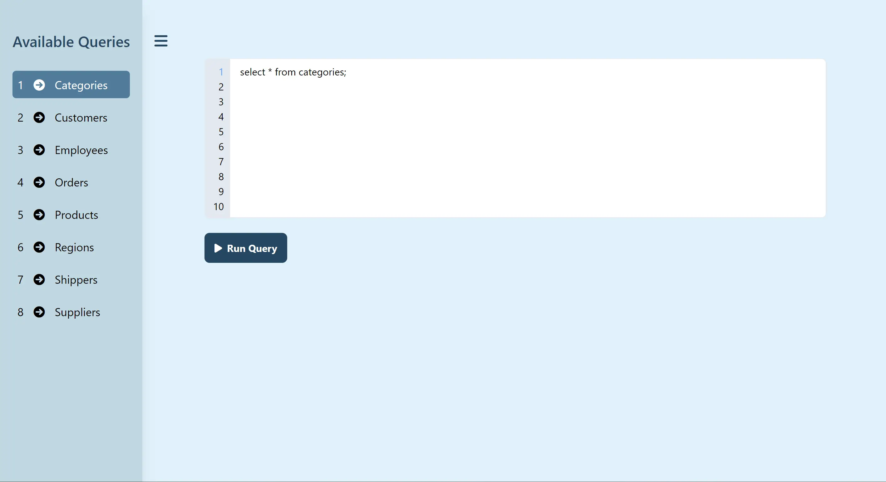

<h1 align="center">SQL Editor</h1>
<h3 align="center">Link - https://main--bright-caramel-5b4e2f.netlify.app/</h3>

---

## Overview
This is an SQL Editor built using React JS and Tailwind CSS. There are various available queries that you can choose and run. You can also download the table data in three different formats - CSV, excel, and JSON.

## Tech Stack and packages used
- React JS
  - `react-toastify` for notifications
  - `ag-grid-react` to display tables
- Tailwind CSS

## Chrome Devtools Lighthouse Report for the website

## Screenshots

